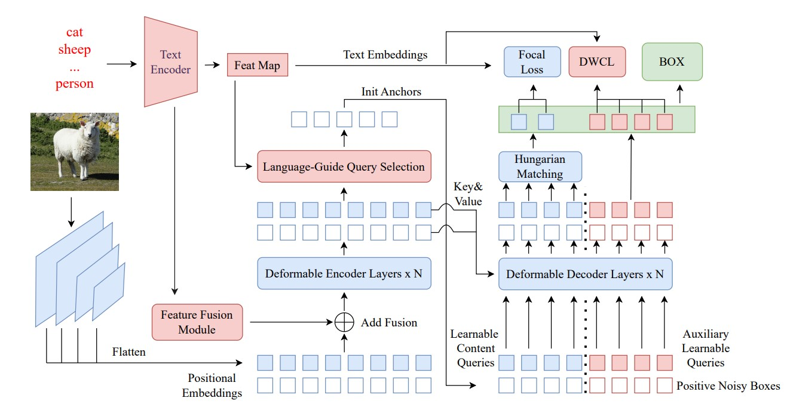

# HDINO

This is the official implementation of **HDINO**.

Please feel free to reach out if you have any questions or suggestions.

## Updates

* **[2026-03-13]**: Repository initialized and model weights uploaded.

## Architecture



### Zero-shot Results on COCO 2017 val

| Model | Backbone | Training Data | Zero-Shot 2017val |
|------|------|------|------|
| DyHead-T | Swin-T | O365 | 43.6 |
| GLIP-T (B) | Swin-T | O365 | 44.9 |
| GLIP-L | Swin-L | FourODs, GoldG, Cap24M | 49.8 |
| Grounding-DINO-T | Swin-T | O365, GoldG, Cap4M | 48.4 |
| Grounding-DINO-L | Swin-L | O365, OpenImages, GoldG | 52.5 |
| T-Rex2-T | Swin-T | O365, GoldG, OpenImages, Bamboo, CC3M, LAION | 46.4 |
| YOLO-World-S | YOLOv8-S | O365, GoldG | 37.6 |
| YOLO-World-M | YOLOv8-M | O365, GoldG | 42.8 |
| YOLO-World-L | YOLOv8-L | O365, GoldG | 44.4 |
| YOLO-World-L | YOLOv8-L | O365, GoldG, CC3M | 45.1 |
| **HDINO-T (ours)** | Swin-T | O365, OpenImages | **49.2** |
| **HDINO-L (ours)** | Swin-L | O365, OpenImages | **51.7** |

### 1. Create a virtual environment

```bash
conda create -n hdino python=3.10 -y
conda activate hdino
```

### 2. Install PyTorch and CUDA

The following command installs the specific versions used in our development environment (PyTorch 2.1.0 + CUDA 12.1):

```bash
torch           2.1.0+cu121
torchvision     0.16.0+cu121
```

### 3. Install custom operators

Navigate to the `models/HDINO/ops` directory and install the operators:

```bash
cd models/HDINO/ops
pip install -e .
```

### 🎨 Demo

You can run our interactive demo locally to experience **HDINO**:

```bash
python gradio_demo.py
```

## 📜 Acknowledgement

We express our sincere gratitude to the authors for their contributions to the community:

* [DINO](https://github.com/IDEA-Research/DINO)
* [Grounding DINO](https://github.com/IDEA-Research/GroundingDINO)
* [Open-GroundingDino](https://github.com/longzw1997/Open-GroundingDino)
